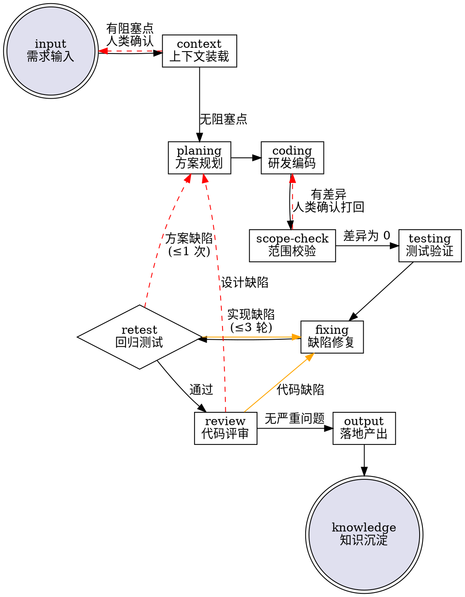

# 人机协作开发工作流

## The Iron Law

```
人类决策，AI 执行。每个阶段的 Checkpoint（🚨）必须停下来等待人类确认，不可跳过。
任何可能破坏项目状态的操作（危险命令、merge、force-push）必须请示人类。
```

**Violating the letter of this process is violating the spirit of this workflow.**

## When to Use

**必须使用：**
- 新功能开发
- Bug 修复（非拼写/格式类）
- 跨文件重构
- 依赖变更

**可以跳过：**
- 单行/单文件拼写或格式修正
- 回答纯技术问题
- 人类明确指示"直接改，不用走流程"

## 目录结构

每个阶段将产出写入项目根目录下的 `.workflow/`：

```
.workflow/
  plans/                    # 方案文档
    YYYY-MM-DD-<topic>-plan.md
  tests/                    # 测试用例与测试报告
    cases/                  # 用例文件
      YYYY-MM-DD-<topic>-cases.md
    reports/                # 测试报告
      YYYY-MM-DD-<topic>-test-report.md
  review/                   # 评审报告（review 阶段产出）
    YYYY-MM-DD-<topic>-review.md
  knowledge/                # 知识沉淀
    decisions/              # ADR 决策记录
    updates/                # 记忆更新
  reports/                  # 最终输出报告
    YYYY-MM-DD-<topic>-final.md
```

> 所有对话开始前确保 `.workflow/` 存在。各阶段的具体产出和目录见下。

---

## Process Flow



---

## 阶段索引

各阶段的详细执行指令已拆分到独立插件中。

**插件调用规则：**
1. 进入某阶段时，若对应插件已安装，**必须**通过 `Skill` 工具调用该插件获取完整执行指令。
2. 插件未安装时，按本表简述 + 自身知识执行，不阻塞流程。
3. 本文件不硬编码任何具体 skill 引用——运行时根据 system-reminder 中的可用技能列表自动匹配。

| 阶段 | 目标 | 插件 | 🚨Checkpoint |
|------|------|------|-------------|
| 1/11 input | 需求理解与对齐 | — | AI 复述需求，等待人类确认 |
| 2/11 context | 代码库检索与可行性校验 | `dw-planing` | 有阻塞点→报告人类；无→自动进入 planing |
| 3/11 planing | 方案设计与用例编写 | `dw-planing` | 方案评审 + 用例评审，两次人类确认 |
| 4/11 coding | 按方案编码，不扩展范围 | `dw-implement` | — |
| 5/11 scope-check | 变更范围一致性校验 | `dw-implement` | 差异为 0→自动进入 testing；有差异→报告人类 |
| 6/11 testing | 执行测试用例，产出报告 | `dw-quality` | — |
| 7/11 fixing | 缺陷分类与修复 | `dw-quality` | 非轻量修复→人类评审 |
| 8/11 retest | 回归验证，循环熔断 | `dw-quality` | fixing 循环 >3 轮 或 planing 回退 >1 次→暂停 |
| 9/11 review | 设计/逻辑/安全三维审查 | `dw-delivery` | 严重问题→报告人类决策 |
| 10/11 output | 代码落地、PR、最终报告 | `dw-delivery` | CI 通过后→人类确认合并 |
| 11/11 knowledge | ADR 归档与记忆更新 | `dw-delivery` | — |

> 可用 `dw-installer` 扫描本地 skill 目录，生成阶段→技能映射文件（`.workflow/mappings.json`），辅助 AI 在阶段内选择最合适的执行技能。

---

## 操作安全边界

### 以下操作在任何阶段都必须请示人类，不得擅自执行：

| 操作 | 说明 |
|------|------|
| `rm -rf`、`git reset --hard`、`git push --force` | 不可逆操作 |
| `git commit` / `git push` | 除非人类在对话中明确要求 |
| `git merge` / PR 合并 | output 阶段 CI 通过后请示 |
| `npm install <new-pkg>` / 新增依赖 | planing 阶段声明，人类批准后再执行 |
| 修改 `.env`、credentials、secrets | 绝对禁止 |
| 修改 CI/CD 配置文件（`.github/workflows/` 等） | 请示后再动 |
| 数据库迁移 | 请示并确认备份后再执行 |
| 非当前项目的文件、系统配置 | 必须取得明确授权 |

### 以下场景应立即暂停并报告：

- fixing 循环超过 3 轮
- planing 回退超过 1 次
- review 阶段发现安全漏洞或设计级缺陷
- context 阶段发现架构级阻塞点
- 需求本身存在逻辑矛盾

---

## Anti-Patterns

| 你以为可以…… | 实际不应该…… |
|--------------|---------------|
| "需求很清晰，跳过 context 直接写代码" | 跳过 context = 在错误假设上建一切。context 免费，推倒重来很贵。 |
| "方案在脑子里清楚了，直接写吧" | 未确认的方案 = 未对齐的预期。planing 的 5 分钟省 coding 的 5 小时。 |
| "顺带修个无关的小问题" | coding 阶段只动方案范围内的代码。顺手修 = 顺手埋新 bug。 |
| "测试报了三个问题但我知道原因，直接修" | fixing 前必须分析根因。跳过分析 = 重复修同个 bug。 |
| "小改动不用走 review" | review 是安全最后一关。OWASP 漏洞往往就在"小改动"里。 |
| "这个太简单，不用走流程" | 简单任务是最容易跳步骤、出低级错误的场景。 |

---
